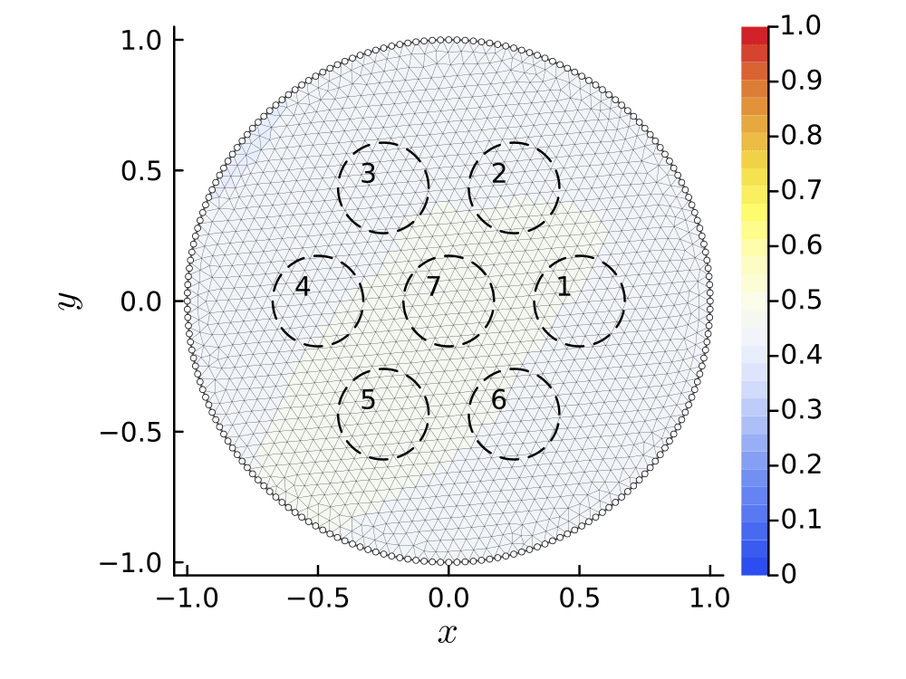

# Applying Adjoints Twice: Poisson Example

Reproducibility Repository accompanying the presentation [Applying Adjoints Twice](https://tam724.github.io/Applying-Adjoints-Twice_presentation/) ([repo link](https://github.com/tam724/Applying-Adjoints-Twice_presentation)).

Here, we exemplarily implement a inverse problem that (using adjoint approaches) can be implemented quite efficiently.
The forward model is given by the poisson equation with spatially varying heat coefficient (the unknown). Measurements are obtained by multiple Dirichlet-boundary excitations and extraction by averaging certain parts of the domain. For details see the [slides](http://127.0.0.1:3000/index.html#/poisson-example).


To reproduce plots and compute benchmark results, first activate and instantiate the `Project.toml`, then run the script `plot_script.jl`

```julia
pkg> activate 
julia> include("plot_script.jl")
```

In `main.jl` we have implemented a possible application: We parametrize the heat capacity using a (simple, dense) neural network, with predefined "heat capacity values". This transforms the inverse problem into a "phase classification problem". With "good" initial parameters, after running
```julia
julia> include("main.jl")
```
you'll get something like this:



